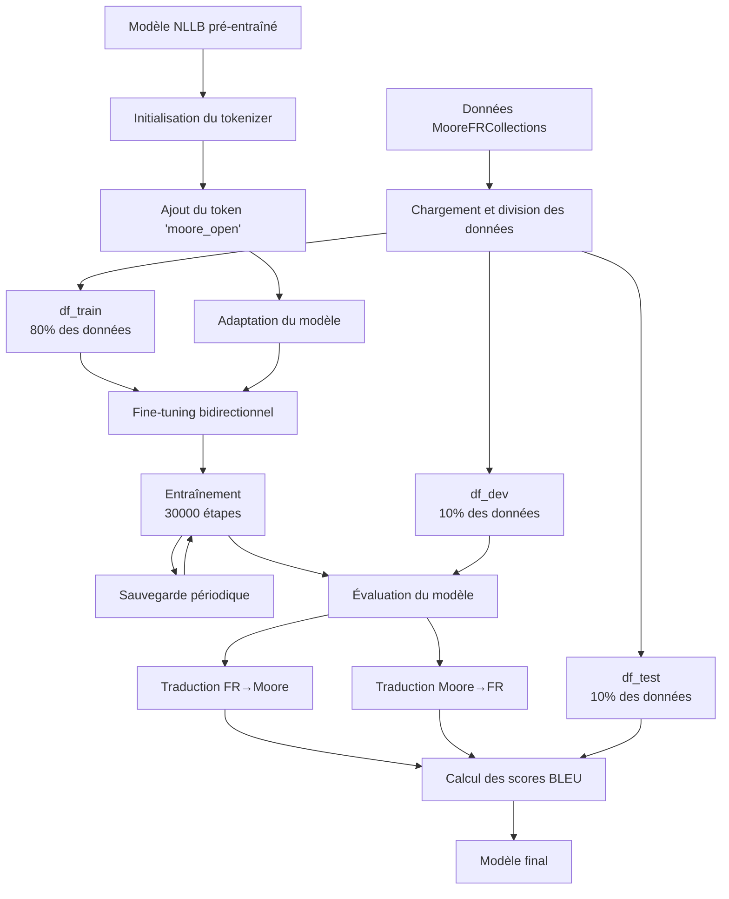

# Fine-tuning de NLLB pour la traduction français-mooré

Ce projet implémente le fine-tuning du modèle multilingue NLLB (No Language Left Behind) de Facebook pour la traduction bidirectionnelle entre le français et le mooré, une langue parlée au Burkina Faso.

## Résumé

Ce projet utilise un modèle NLLB pré-entraîné et l'adapte à la langue mooré en:
1. Ajoutant un nouveau token de langue `moore_open` au tokenizer
2. Fine-tunant le modèle sur un corpus parallèle français-mooré
3. Évaluant les performances de traduction dans les deux directions

## Table des matières

- [Description des données](#description-des-données)
- [Méthodologie](#méthodologie)
- [Structure du code](#structure-du-code)
- [Installation et prérequis](#installation-et-prérequis)
- [Utilisation](#utilisation)
- [Résultats](#résultats)
- [Limitations et améliorations possibles](#limitations-et-améliorations-possibles)

## Description des données

Les données utilisées proviennent du dataset `sawadogosalif/MooreFRCollections` disponible sur Hugging Face. Ce corpus contient des paires de phrases en français et en mooré.

**Statistiques du corpus**:
- Taille totale: Variable selon la version actuelle du dataset
- Division: 
  - Entraînement (df_train): 80% du corpus
  - Validation (df_dev): 10% du corpus 
  - Test (df_test): 10% du corpus

## Méthodologie

### Préparation des données

1. **Chargement et division**: Les données sont chargées et divisées aléatoirement en trois ensembles: entraînement, validation et test.
2. **Prétraitement**:
   - Normalisation de la ponctuation
   - Suppression des caractères non imprimables
   - Normalisation des formes Unicode (NFKC)

### Adaptation du modèle

1. **Tokenizer**:
   - Chargement du tokenizer NLLB standard
   - Ajout du token `moore_open` pour représenter la langue mooré
   - Restructuration des tables de mapping du tokenizer

2. **Modèle**:
   - Chargement du modèle NLLB pré-entraîné
   - Redimensionnement des embeddings pour inclure le nouveau token

### Fine-tuning

L'entraînement est réalisé avec:
- **Modèle de base**: `facebook/nllb-200-distilled-600M`
- **Optimiseur**: Adafactor (recommandé pour les modèles seq2seq)
- **Learning rate**: 1e-4 avec warmup
- **Batch size**: 16 (adapté pour GPU de 15GB)
- **Étapes d'entraînement**: 30 000
- **Approche bidirectionnelle**: À chaque étape, direction de traduction aléatoire (FR→Moore ou Moore→FR)

### Évaluation

L'évaluation est réalisée sur:
- **Ensemble de validation** (df_dev) durant l'entraînement
- **Ensemble de test** (df_test) pour l'évaluation finale

Les métriques d'évaluation incluent:
- **Score BLEU**: Mesure standard pour évaluer la qualité des traductions
- **Exemples de traduction**: Comparaison directe entre traductions et références

## Structure du code

Le code est organisé en fonctions modulaires:

- `setup_environment()`: Configuration initiale
- `load_and_split_data()`: Chargement et division des données
- `preprocess_text()`: Prétraitement des textes
- `fix_tokenizer()`: Adaptation du tokenizer pour le mooré
- `train_model()`: Entraînement du modèle
- `translate()`: Fonction de traduction
- `evaluate_model()`: Évaluation du modèle
- `calculate_bleu_scores()`: Calcul des scores BLEU
- `visualize_training()`: Visualisation des résultats
- `main()`: Orchestration du processus complet

## Installation et prérequis

### Dépendances

```bash
pip install datasets sentencepiece transformers==4.33 sacremoses sacrebleu
```

### Matériel recommandé
A
- GPU avec au moins 15GB de mémoire (par exemple, NVIDIA T4 ou V100)
- Espace de stockage: au moins 10GB pour le modèle et les checkpoints

## Utilisation

### Entraînement

Pour lancer l'entraînement complet:

```python
python fine_tune_nllb_moore.py
```

### Inférence

Pour utiliser le modèle entraîné pour la traduction:

```python
from transformers import NllbTokenizer, AutoModelForSeq2SeqLM

# Chargement du modèle et du tokenizer
tokenizer = NllbTokenizer.from_pretrained("chemin/vers/modèle/sauvegardé")
model = AutoModelForSeq2SeqLM.from_pretrained("chemin/vers/modèle/sauvegardé")

# Fix du tokenizer pour le mooré
tokenizer = fix_tokenizer(tokenizer, 'moore_open')

# Traduction français → mooré
texte_francais = "Bonjour, comment allez-vous ?"
traduction_moore = translate(model, tokenizer, texte_francais, 'fra_Latn', 'moore_open')
print(traduction_moore)

# Traduction mooré → français
texte_moore = "Neb daar yʋʋmdã."
traduction_francais = translate(model, tokenizer, texte_moore, 'moore_open', 'fra_Latn')
print(traduction_francais)
```

## Résultats

Les résultats d'évaluation incluent:

- **Scores BLEU** (à compléter après entraînement):
  - Français → Mooré: XX.XX
  - Mooré → Français: XX.XX

- **Exemples de traductions**:

| Français (original) | Mooré (traduction) | Mooré (référence) |
|---------------------|---------------------|-------------------|
| *exemples à ajouter* | *exemples à ajouter* | *exemples à ajouter* |

| Mooré (original) | Français (traduction) | Français (référence) |
|------------------|------------------------|----------------------|
| *exemples à ajouter* | *exemples à ajouter* | *exemples à ajouter* |

- **Courbe d'apprentissage**:
  - Voir le graphique de perte généré pendant l'entraînement.
  

## Limitations et améliorations possibles

- **Taille du modèle**: Utiliser un modèle NLLB plus grand pourrait améliorer les performances
- **Augmentation de données**: Techniques comme le back-translation pourraient enrichir le corpus
- **Vocabulaire spécifique**: Pré-entraîner un tokenizer spécifique au mooré pourrait améliorer la couverture lexicale
- **Hyperparamètres**: Une recherche plus approfondie des hyperparamètres optimaux pourrait améliorer les résultats

## Citation

Si vous utilisez ce code, veuillez citer ce projet ainsi que les travaux originaux du modèle NLLB:

```bibtex
@article{costa2022no,
  title={No Language Left Behind: Scaling Human-Centered Machine Translation},
  author={NLLB Team et al.},
  journal={arXiv preprint arXiv:2207.04672},
  year={2022}
}
```