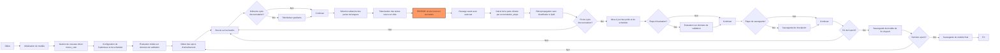

To do

```mermaid
flowchart LR
    A[Début] --> B[Initialisation du modèle]
    B --> C[Gestion de nouveau token moore_Latn]
    C --> D[Configuration de l'optimiseur et du scheduler]
    D --> E[Évaluation initiale sur données de validation]
    E --> F[Début des epocs d'entraînement]
    
    F --> G[Boucle sur les batchs]
    G --> H{Début du cycle\nd'accumulation?}
    H -- Oui --> I[Réinitialiser gradients]
    H -- Non --> J[Continuer]
    I --> J
    
    J --> K[Sélection aléatoire des paires de langues]
    K --> L[Tokenisation des textes source et cible]
    
    L --> M[ERREUR: Accès incorrect aux labels]
    
    M --> N[Passage avant avec autocast]
    N --> O[Calcul de la perte divisée par accumulation_steps]
    O --> P[Rétropropagation avec GradScaler si fp16]
    
    P --> Q{Fin du cycle\nd'accumulation?}
    Q -- Non --> G
    Q -- Oui --> R[Mise à jour des poids et du scheduler]
    
    R --> S{Étape d'évaluation?}
    S -- Oui --> T[Évaluation sur données de validation]
    S -- Non --> U[Continuer]
    T --> U
    
    U --> V{Étape de sauvegarde?}
    V -- Oui --> W[Sauvegarde du checkpoint]
    V -- Non --> X[Continuer]
    W --> X
    
    X --> Y{Fin de l'epoch?}
    Y -- Non --> G
    Y -- Oui --> Z[Sauvegarde du modèle de fin d'epoch]
    
    Z --> AA{Dernière epoch?}
    AA -- Non --> F
    AA -- Oui --> AB[Sauvegarde du modèle final]
    AB --> AC[Fin]
    
    %% Points problématiques
    M:::errorClass
    
    %% Définition des styles
    classDef errorClass fill:#f96,stroke:#333,stroke-width:2px;
```
